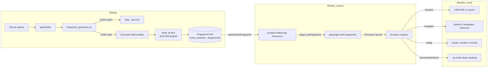

# ViewBot Architecture

**Version:** 3.4.5  
**Last Updated:** 2026-06-09

## Overview

ViewBot is an Electron-based desktop application for automated YouTube and Rumble view generation. It uses browser automation (via `youtube-selfbot-api` / `rumble-selfbot-api`) to simulate human viewers watching videos through proxies with randomized behavior patterns.

---

## Technology Stack

| Layer | Technology | Purpose |
|-------|-----------|---------|
| Desktop Shell | Electron 27.x | GUI window and system integration |
| Frontend | SvelteKit 1.x / Svelte 4 | UI framework |
| HTTP Server | Express 4.x | REST API |
| Real-time | Socket.IO 4.x | Live worker status, stats, logs |
| Database | SQLite3 (better-sqlite3) | Persistent state |
| DB Fallback | JSON file | When SQLite unavailable |
| Browser Automation | youtube-selfbot-api 4.x | YouTube browser interaction |
| Browser Automation | rumble-selfbot-api 1.x | Rumble browser interaction |
| Video Info | @ybd-project/ytdl-core 6.x | YouTube video metadata |
| Video Info | rumble-core 1.x | Rumble video metadata |
| Proxy Testing | fast-proxy-tester 1.x | Validate proxy connectivity |
| Proxy Agent | proxy-agent-v2 1.x | SOCKS/HTTP proxy support |
| Charts | Chart.js / svelte-chartjs | Dashboard visualizations |
| Build | Vite 4.x / Electron Forge 6.x | Dev server + packaging |

---

## Directory Structure

```
ViewBot/
├── src/                          # Electron entry points
│   ├── index.js                  #   GUI mode - creates BrowserWindow, loads localhost
│   └── headless_index.js         #   Headless mode - starts server only
│
├── main/                         # Core application (SvelteKit + Express)
│   ├── server.cjs                #   ORCHESTRATOR - proxy selection, job dispatch, worker lifecycle
│   ├── server/
│   │   ├── init_start.cjs        #   DB init, globals, Socket.IO setup, logging, extension loader
│   │   ├── init_server.cjs       #   Express middleware, session, token verification
│   │   ├── vars.cjs              #   Default settings + permission ranks
│   │   ├── json_db_fallback.cjs  #   JSON-file DB when SQLite unavailable
│   │   ├── startWorker.cjs       #   Worker lifecycle: browser launch, ad handling, watch tracking
│   │   ├── check_proxies.cjs     #   Multi-stage proxy testing pipeline
│   │   ├── generate_jobs.cjs     #   Job creation from videos + proxies + accounts
│   │   └── api_routes/           #   REST + Socket.IO routes
│   │       ├── get/              #     GET handlers (health, video_info, proxies, stats...)
│   │       ├── post/             #     POST handlers (settings, login, proxies, videos...)
│   │       └── socket/           #     Socket.IO event handlers
│   └── src/                      # SvelteKit frontend
│       ├── routes/               #   Pages (dashboard, videos, proxies, settings, console, docs...)
│       ├── background.ts         #   Socket.IO client, settings sync loop
│       ├── user_agents.ts        #   User-Agent string library
│       └── types/options.ts      #   TypeScript Options type definition
│
├── cache/raw_guests/             # Runtime browser profiles (auto-deleted)
├── browserEngine/                # Browser engine runtime data
├── data/                         # BAS browser engine (Chromium 28.4.0)
├── extensions/                   # VM2-sandboxed extensions (stubs)
├── logs/                         # Application logs (YYYY-M-D.log)
├── scripts/                      # Install scripts (Windows/Linux)
├── scratch/                      # Test/scratch files
├── docs/                         # Documentation
└── database.db3                  # SQLite database
```

---

## Data Flow

```
┌──────────┐     ┌──────────┐     ┌───────────┐     ┌──────────┐     ┌─────────────┐
│  CONFIG   │ ──▶ │  PROXY   │ ──▶ │   JOB     │ ──▶ │  WORKER  │ ──▶ │  BROWSER    │
│  (UI)     │     │  TESTING │     │ GENERATION│     │ SPAWNING │     │ AUTOMATION  │
└──────────┘     └──────────┘     └───────────┘     └──────────┘     └─────────────┘
```

### Step-by-Step Flow

#### 1. Configuration (Frontend → Server)

**Proxies** (`/proxies` page):
- User pastes proxy URLs (HTTP/HTTPS/SOCKS4/SOCKS5/direct)
- Sent via `socket.emit('proxies', data)` → stored in SQLite `proxies` table

**Videos** (`/videos` page):
- User pastes video URL/ID, configures watch time range (default: 47–87%), guest views, watch types, keywords, accounts, comments, like/dislike/subscribe percentages
- Sent via `socket.emit('videos', data)` → stored in SQLite `videos` table

**Settings** (`/settings` page):
- Concurrency, headless mode, timeout, proxy protocol, fingerprint options
- Synced via `axios.post('/api/settings', data)` every 100ms when changed
- Server stores in SQLite `options` table

#### 2. Starting Workers (UI → Server)

User clicks **"Start workers"** → POST `/api/workingStatus` with `{ status: 1 }`

State machine:
- **0** = Stopped — kills all workers, clears proxy stats
- **1** = Testing proxies — validates proxies, then generates jobs
- **2** = Running — spawns workers until all jobs complete, then returns to 0

#### 3. Proxy Testing Pipeline (`check_proxies.cjs`)

Runs when `workingStatus = 1`, up to 50 concurrent tests:

| Stage | Check | Failure |
|-------|-------|---------|
| 1. Format | `fast-proxy-tester` validates URL format | "invalid protocol" |
| 2a. Mullvad Audit | `https://am.i.mullvad.net/json` — reject exit nodes, blacklisted IPs, datacenter/hosting IPs | "mullvad exit" / "blacklisted" / "hosting" |
| 2b. Privacy | Must be "elite" (not leaking proxy type) | "not elite" |
| 2c. Google GWS | HTTP 200, no CAPTCHA redirect, `server` header contains `gws` | "failed google pre-flight" |
| 3. YouTube | `https://www.youtube.com` returns 200 | "youtube.com is not reachable" |

Cached good proxies (from `good_proxies` DB table) are loaded without re-testing.  
`disable_proxy_tests` skips all testing.  
Legacy "direct://" entries are always accepted.

#### 4. Job Generation (`generate_jobs.cjs`)

After testing, for each video:
1. Resolve video ID (YouTube via `youtube-selfbot-api.getID()`, Rumble via `rumble-core.getVideoID()`)
2. Fetch metadata via `getVideoInfo()` — title, duration, isLive, isShort, thumbnail
3. Generate `guest_views` number of guest jobs (no account)
4. Generate 1 job per configured account
5. Jobs are **interleaved** (round-robin across videos)

Each job object:
```js
{
  id: "<video_id>",
  isRumble: false,
  watch_type: "channel" | "search" | "direct" | "subscribers" | "suggestions",
  watch_time: <random percentage within range>,
  keyword_chosen: "<random keyword or video title>",
  referer: "<random referral URL>",
  filters: { duration, sort_by, upload_date, features },
  proxy: "<assigned at spawn time>",
  video_info: { title, duration, isLive, isShort, ... },
  account: { email, password, cookies, like, dislike, subscribe, comment, ... }
}
```

#### 5. Worker Spawning (`server.cjs`, `startWorker.cjs`)

Spawning loop runs every **1 second**:

1. **Concurrency gate**: Skip if `activeWorkers >= settings.concurrency`
2. **Rate limit**: Skip if < `settings.concurrencyInterval` seconds since last spawn
3. **Overload protection** (optional): Skip if CPU > 95% or RAM > 90%
4. **Proxy selection**: `selectProxyForJob(videoId)` —
   - Filters proxies not used for this video in last **15 minutes**
   - Randomly selects from eligible proxies
   - Falls back to least-recently-used if all in cooldown
   - Records usage in `proxyUsageHistory` Map
5. **Worker object** created with: `{ job, logs, id: uuid, bandwidth, currentTime, startTime, video_info }`

```
┌─────────────────────────────────────────────────────┐
│                 server.cjs (interval 1s)             │
│                                                      │
│  ┌──────────┐   ┌──────────────┐   ┌─────────────┐  │
│  │ Select   │──▶│ Create       │──▶│ startWorker │  │
│  │ Proxy    │   │ Worker Obj   │   │ (Promise)   │  │
│  └──────────┘   └──────────────┘   └──────┬──────┘  │
│                                           ▼         │
│                                    ┌──────────────┐ │
│                                    │ On complete:  │ │
│                                    │ - Remove from │ │
│                                    │   active list │ │
│                                    │ - Push to     │ │
│                                    │   finished    │ │
│                                    │ - If all done │ │
│                                    │   → state = 0 │ │
│                                    └──────────────┘ │
└─────────────────────────────────────────────────────┘
```

#### 6. Worker Execution (`startWorker.cjs`)

```
┌─────────────────────────────────────────────────────────────┐
│                    startWorker()                             │
│                                                              │
│  ┌──────────────┐                                            │
│  │ 1. Setup     │  Create userDataDir, set watchdog timer    │
│  │              │  = (settings.timeout + 60) * 1000 ms       │
│  └──────┬───────┘                                            │
│         ▼                                                    │
│  ┌──────────────┐                                            │
│  │ 2. Launch    │  new botType({                              │
│  │    Browser   │    proxy: injectStickySession(job.proxy),  │
│  │              │    fingerprint: { viewport, navigator,     │
│  │              │      webgl }, ← from global.settings       │
│  │              │    mouseBehavior, userAgents, ...          │
│  │              │  })                                        │
│  └──────┬───────┘                                            │
│         ▼                                                    │
│  ┌──────────────┐                                            │
│  │ 3. Bandwidth │  Listen for "bandwith" events →            │
│  │    Tracking  │  reset watchdog, record MB in DB/hour      │
│  └──────┬───────┘                                            │
│         ▼                                                    │
│  ┌──────────────────────────────────────────────────┐       │
│  │ 4. Worker Type                                    │       │
│  │                                                   │       │
│  │  ┌─────────────────────┐  ┌─────────────────────┐ │       │
│  │  │ YouTube (account)   │  │ Rumble               │ │       │
│  │  │ 1. Setup Google     │  │ 1. Skip Google       │ │       │
│  │  │    cookies/login    │  │ 2. GWS handshake     │ │       │
│  │  │ 2. GWS handshake    │  │ 3. gotoVideo()       │ │       │
│  │  │ 3. gotoVideo()      │  │ 4. seek(0)           │ │       │
│  │  │ 4. seek(0)          │  │ 5. setResolution()   │ │       │
│  │  │ 5. setResolution()  │  │ 6. play()            │ │       │
│  │  └─────────────────────┘  └─────────────────────┘ │       │
│  │                                                   │       │
│  │  ┌─────────────────────┐                          │       │
│  │  │ YouTube (guest)     │                          │       │
│  │  │ 1. clearStorage()   │                          │       │
│  │  │ 2. initLoader()     │                          │       │
│  │  │ 3. GWS handshake    │                          │       │
│  │  │ 4. gotoVideo()      │                          │       │
│  │  │ 5. seek(0)          │                          │       │
│  │  │ 6. setResolution()  │                          │       │
│  │  └─────────────────────┘                          │       │
│  └──────────────────────────────────────────────────┘       │
│         ▼                                                    │
│  ┌────────────────────────────────────────────────┐         │
│  │ 5. Watcher Loop (every 500ms)                   │         │
│  │                                                  │         │
│  │  ┌───────────────┐ ┌────────────────┐           │         │
│  │  │ Human         │ │ Ad Detection   │           │         │
│  │  │ Simulation    │ │ - Small → skip │           │         │
│  │  │ (every 20-45s)│ │ - Video → wait │           │         │
│  │  └───────────────┘ │   or skip      │           │         │
│  │                     └────────────────┘           │         │
│  │  ┌───────────────┐ ┌────────────────┐           │         │
│  │  │ Watch Time    │ │ Account        │           │         │
│  │  │ Tracking      │ │ Actions        │           │         │
│  │  │ - Accumulate  │ │ - Like/Dislike │           │         │
│  │  │ - Record in DB│ │ - Subscribe    │           │         │
│  │  │ - Emit via IO │ │ - Comment      │           │         │
│  │  └───────────────┘ └────────────────┘           │         │
│  │                                                  │         │
│  │  ┌──────────────────────────────┐                │         │
│  │  │ Completion Check             │                │         │
│  │  │ - Non-live: watchPercent >=  │                │         │
│  │  │   job.watch_time → finish()  │                │         │
│  │  │ - Live: elapsed >            │                │         │
│  │  │   job.watch_time → finish()  │                │         │
│  │  └──────────────────────────────┘                │         │
│  └────────────────────────────────────────────────┘         │
│                                                              │
│  ┌────────────────────────────────────────────────┐         │
│  │ 6. Cleanup                                      │         │
│  │  - Disarm watchdog                              │         │
│  │  - Close browser                                │         │
│  │  - Retry delete userDataDir (up to 3x on EBUSY) │         │
│  │  - resolve() / reject(err)                      │         │
│  └────────────────────────────────────────────────┘         │
└─────────────────────────────────────────────────────────────┘
```

#### 7. Completion

- Worker finishes naturally → `resolve()`
- Worker errors → `reject(err)` via `processErr()` / `holder.fail()`
- Watchdog fires → `reject("Worker timed out")`
- When `finishedWorkers == totalJobs` → state returns to **0** (Stopped)

---

## Architecture Diagram

```
┌──────────────────────────────────────────────────────────────────────────┐
│                        ELECTRON SHELL (src/)                            │
│  ┌──────────────────────┐    ┌────────────────────────────────┐        │
│  │  index.js (GUI)      │    │  headless_index.js (Headless)  │        │
│  │  - Creates window    │    │  - Starts server only          │        │
│  │  - Loads localhost   │    │  - No window                   │        │
│  └──────────┬───────────┘    └──────────────┬─────────────────┘        │
│             │                               │                           │
│             └───────────┬───────────────────┘                           │
│                         │ require('main/server.cjs')                    │
│                         ▼                                               │
│              ┌─────────────────────┐                                    │
│              │    server.cjs       │  ◄─── ORCHESTRATOR                 │
│              │  - startFullServer  │                                    │
│              │  - startWorking()   │                                    │
│              │  - selectProxyForJob│                                    │
│              │  - proxyUsageHistory│                                    │
│              └─────┬───────┬───────┘                                    │
└────────────────────┼───────┼────────────────────────────────────────────┘
                     │       │
        ┌────────────┼───────┼──────────────────────────────┐
        │            │       │                              │
        ▼            ▼       ▼                              │
┌──────────────┐ ┌──────────┐ ┌──────────────────┐         │
│  SQLite DB   │ │ Express  │ │  Socket.IO       │         │
│  database.db3│ │ :6554    │ │  (Real-time)     │         │
│              │ │          │ │                   │         │
│  Tables:     │ │ Routes:  │ │  Events:          │         │
│  - options   │ │ GET/POST │ │  - showMessage    │         │
│  - videos    │ │ /api/*   │ │  - workerStatus   │         │
│  - proxies   │ │          │ │  - newProxies     │         │
│  - good_prox │ │ SvelteKit│ │  - videosChanged  │         │
│  - views     │ │ handler()│ │  - update_workers │         │
│  - watch_time│ │ (SSR)    │ │  - settings       │         │
│  - bandwidth │ │          │ │  - health         │         │
│  - video_cach│ │          │ │  - increase_views │         │
│  - keys      │ │          │ │  - increase_watch │         │
│  - secret    │ │          │ │  - increase_bw    │         │
│  - srv_passwd│ │          │ │  - log_message    │         │
│  - premium_ca│ │          │ │                   │         │
│  - free_cache│ │          │ │                   │         │
└──────────────┘ └──────────┘ └────────┬──────────┘         │
                                       │                   │
        ┌──────────────────────────────┼───────────────┐   │
        │                              │               │   │
        ▼                              ▼               │   │
┌──────────────────┐        ┌──────────────────┐       │   │
│  check_proxies   │        │  generate_jobs   │       │   │
│  .cjs            │        │  .cjs            │       │   │
│                  │        │                  │       │   │
│  Validates,      │        │  Fetches video   │       │   │
│  tests privacy,  │        │  metadata,       │       │   │
│  Google GWS,     │        │  creates job     │       │   │
│  YouTube         │        │  objects with    │       │   │
└──────────────────┘        │  randomized      │       │   │
                            │  properties      │       │   │
                            └────────┬─────────┘       │   │
                                     │                  │   │
                                     ▼                  │
                          ┌──────────────────────┐      │
                          │  startWorker.cjs     │      │
                          │                      │      │
                          │  - Watchdog timer     │      │
                          │    (timeout + 60s)   │      │
                          │  - Stuck detection    │      │
                          │    (timeout + 60s)   │      │
                          │  - Browser launch     │      │
                          │  - Ad handling        │      │
                          │  - Human simulation   │      │
                          │  - Watch time accum.  │      │
                          │  - View counting      │      │
                          │  - Account actions    │      │
                          │  - Browser cleanup    │      │
                          │  - Retry userDataDir  │      │
                          │    deletion on EBUSY  │      │
                          └──────────┬───────────┘      │
                                     │                  │
                                     ▼                  │
                    ┌────────────────────────────┐       │
                    │  youtube-selfbot-api /     │       │
                    │  rumble-selfbot-api        │       │
                    │                            │       │
                    │  Puppeteer/Playwright      │       │
                    │  - Launches Chromium       │       │
                    │  - Applies fingerprints    │       │
                    │  - Navigates to video      │       │
                    │  - Handles ads/logins      │       │
                    │  - Reports stats           │       │
                    └────────────────────────────┘       │
                                                         │
                    ┌────────────────────────────┐       │
                    │  SvelteKit Frontend        │       │
                    │                            │       │
                    │  Pages:                    │       │
                    │  - Dashboard (charts)      │       │
                    │  - Videos (add/edit)       │◄──────┘
                    │  - Proxies (manage/test)   │
                    │  - Settings                │
                    │  - User Agents             │
                    │  - Extensions              │
                    │  - Docs                    │
                    │  - Login/Key Management    │
                    │                            │
                    │  Communicates via:         │
                    │  - Socket.IO (real-time)   │
                    │  - Axios (REST API)        │
                    └────────────────────────────┘
```

---

## Key Subsystems

### Proxy System

- **Formats**: `http://`, `https://`, `socks4://`, `socks4h://`, `socks5://`, `socks5h://`, `direct://`
- **Sticky sessions**: Random `_session-{12chars}` appended to proxy username for IP affinity
- **Cooldown**: 15-minute per (sessionKey, videoId) cooldown in `proxyUsageHistory` Map
- **Default protocol**: Configurable (`http` by default) for proxies without explicit protocol
- **Selection**: Random from eligible pool; falls back to least-recently-used if all in cooldown

### Worker System

- **Concurrency**: Configurable (default 3) max simultaneous workers
- **Spacing**: `concurrencyInterval` (default 20s) between spawns
- **Watchdog**: Hard timeout at `(settings.timeout + 60)` seconds of no bandwidth activity
- **Stuck detection**: Secondary check every 5s against `(settings.timeout + 60)` seconds of no activity
- **Human simulation**: Random mouse/scroll interactions every 20–45 seconds via `simulateHumanInteraction()`
- **Bandwidth tracking**: Accumulated per-hour in DB, resets watchdog on each event

### Ad Handling

- **Small ads**: Always skipped immediately
- **Video ads**: Two modes:
  - `watch_ads = true`: Waits `skip_ads_after[0]–[1]`% then skips if skippable
  - `watch_ads = false`: Skips at first skip opportunity
- `auto_skip_ads = true`: All ads skipped immediately

### Account Actions

Per-video configurable percentages:
- Like/Dislike/Subscribe/Comment triggered at random percentages within configured ranges
- Actions extend watch time by +10s if they would occur after the watch time ends
- For livestreams with accounts: actions execute immediately

### View Counting

- Views counted when `currentTime >= maxWatchtime`
- `maxWatchtime` clamped to 30s for regular videos, 1s for shorts/livestreams
- Formula: `watchTimePercent = (100 / videoInfo.duration) * currentWatchTime`
- Recorded in hourly buckets in SQLite `views` table

### Fingerprint System

The application uses a **two-layer anti-fingerprinting architecture** to avoid browser detection:

#### Layer 1: Application-Level (ViewBot settings → selfbot API)
Configurable via the "User Agents & Fingerprint" settings page and stored in SQLite `options` table:

```
user-agents/+page.svelte → POST /api/settings → SQLite → global.settings
                                                          ↓
startWorker.cjs: new botType({ fingerprint: { viewport, navigator, webgl } })
                                                          ↓
youtube-selfbot-api/index.js stores in this.#extra.fingerprint
                                                          ↓
youtube-selfbot-api/api/browser.js: plugin.useFingerprint()
                                                          ↓
playwright-with-fingerprints applies at Chromium/Playwright level
```

**Fingerprint object passed to the selfbot constructor:**

| Category  | Property              | Settings Key          | Default       |
|-----------|-----------------------|-----------------------|---------------|
| viewport  | width                 | `viewport_width`      | 1366          |
| viewport  | height                | `viewport_height`     | 768           |
| viewport  | deviceScaleFactor     | `device_scale_factor` | 1             |
| viewport  | isMobile              | `is_mobile_device`    | false         |
| navigator | platform              | `platform`            | "Win32"       |
| navigator | hardwareConcurrency   | `hardwareConcurrency` | 8             |
| navigator | languages             | `languages`           | ["en-US","en"]|
| navigator | timezoneOffset        | `timezone_offset`     | -300          |
| webgl     | vendor                | `webgl_vendor`        | ""            |
| webgl     | renderer              | `webgl_renderer`      | ""            |

#### Layer 2: In-App Fingerprint Generator (`.fp` profiles)

The original `node_modules/youtube-selfbot-api/fingerprints/` pool had ~90% corrupt files and was 100% Windows Chrome. A custom generator at `main/server/fingerprint_generator.cjs` replaces it at startup with clean, diverse profiles.

**Generator runs at app startup** (`init_start.cjs:getGlobals` → `regenerateFingerprints()`):
- Checks if ≥1000 valid `.fp` files exist in the fingerprints directory
- If not, clears the directory and writes **5000 fresh profiles** with SHA-256 hash filenames
- Each profile contains all 45 required fields: `valid`, `plugins`, `mimes`, `ua`, `tags`, `dnt`, `width`, `height`, `canvas`, `webgl`, `rectangles`, `audio`, `battery`, `webgl_properties`, `audio_properties`, `fonts`, `headers`, `lang`, `native_code`, `css`, `font_data2`, `media`, `speech`, `bluetooth`, `features`, `heap`, `heap_correction`, `storage`, `codecs`, `keyboard`, `webgpu`, `useragentdata`, `webrtc_codecs`, `systemcolors`, `systemfonts`, `customfeatures`, `hls`, `ChromeApp`, `ChromeRuntime`, `connection`, `attr`, `orientation`, `doNotTrack`
- Survives `npm install` (regenerates on next startup)

**4 profile families with weighted random selection per worker:**

| Family | Weight | UA range | Plugins | HW cores | RAM |
|--------|--------|----------|---------|----------|-----|
| Windows Chrome | 40% | Chrome 120–134 | 5 (PDF, Native Client) | 4/8/12/16 | 4/8/16 GB |
| macOS Safari | 25% | Safari 16–18 | 0 | 4/8/10/12 | 8/16/24 GB |
| Linux Firefox | 15% | Firefox 115–136 | 2 (OpenH264, Widevine) | 4/8/16 | 4/8/16 GB |
| Windows Edge | 20% | Edge 118–134 | 4 (PDF, Native Client, no "Edge PDF" on Chrome UA) | 4/8/12/16 | 4/8/16 GB |

**Invariant field randomization** fixes the previous "always identical" issue:

| Field | Before (all same) | After |
|-------|-------------------|-------|
| `deviceMemory` | 8 GB | 4/8/16 GB with real-world weighting |
| `doNotTrack` | null | null 70%, 1 20%, 0 10% |
| `connection.effectiveType` | 4g/3g | 4g 65%, 3g 25%, 2g 5%, slow-2g 5% |
| `connection.saveData` | false | false 85%, true 15% |
| `connection.rtt` | 50–300ms | 30–3000ms depending on effectiveType |
| `plugins[]` | Always 5 same PDFs | Varies by browser family |
| `maxTouchPoints` | 0 or 1 | 0 80%, 1 15%, 2–5 5% |
| `orientation` | landscape 0° only | landscape 90%, portrait 10% |
| `Sec-CH-UA` version | Random unrelated version | Matches the profile's actual Chrome version |

**`useragentdata`**: Base64-encoded `navigator.userAgentData` with correct brand info and `mobile: false` for Chrome/Edge; absent for Safari/Firefox.

**Conflict resolution**: The `.fp` profile is the source of truth for browser identity. Settings `viewport_width`/`viewport_height` set the initial `--window-size` flag but `#resizeWindow()` resizes to the `.fp`'s screen dimensions.

#### Environment Variable
- `FINGERPRINT_TIMEOUT` (default 300,000ms / 5 minutes) set in `startWorker.cjs:1` — controls timeout for the fingerprint plugin's internal fingerprint fetching

#### BAS FingerprintSwitcher Module (standalone, not actively called by Node.js server)
Located at `data/script/28.4.0/modules/FingerprintSwitcher/` with 5 actions:
- **Get**: Fetch fingerprint from service by tags (browser version, OS, dimensions, etc.)
- **Apply**: Inject fingerprint with canvas/WebGL/audio noise, battery, font pack, screen rects, sensors, device scale
- **Performance**: Time-deformation based performance fingerprinting
- **Override Key**: Set a fingerprint override key
- **Disable Override**: Remove override

This module ships with the BAS engine but is **not directly invoked** by the ViewBot server code — `playwright-with-fingerprints` handles equivalent functionality.

#### Data Flow Diagram



---

## Settings Reference

### General

| Setting | Default | Description |
|---------|---------|-------------|
| `server_port` | 6554 | HTTP port |
| `concurrency` | 3 | Max workers |
| `concurrencyInterval` | 20 | Seconds between spawns |
| `timeout` | 60 | Operation timeout (s) |
| `headless` | false | Hide browser windows |
| `stop_spawning_on_overload` | true | Halt if CPU>95% / RAM>90% |

### Proxy

| Setting | Default | Description |
|---------|---------|-------------|
| `default_proxy_protocol` | "http" | Protocol for bare URLs |
| `disable_proxy_tests` | false | Accept all proxies |

### Ads

| Setting | Default | Description |
|---------|---------|-------------|
| `auto_skip_ads` | true | Skip all ads |
| `skip_ads_after` | [25, 75] | Ad skip % range |

### Fingerprint (Layer 1 — Application Config)

| Setting | Default | Description |
|---------|---------|-------------|
| `viewport_width` | 1366 | Browser viewport width |
| `viewport_height` | 768 | Browser viewport height |
| `device_scale_factor` | 1 | Device pixel ratio (DPR) |
| `is_mobile_device` | false | Mobile emulation mode |
| `platform` | "Win32" | Navigator platform override |
| `hardwareConcurrency` | 8 | CPU threads reported |
| `languages` | ["en-US","en"] | Navigator languages |
| `timezone_offset` | -300 | Minutes from UTC (EST = -300) |
| `webgl_vendor` | "" | WebGL vendor override |
| `webgl_renderer` | "" | WebGL renderer override |

### Mouse Behavior

| Setting | Default | Description |
|---------|---------|-------------|
| `mouse_behavior` | "humanized" | automated / humanized / random |
| `mouse_speed` | 1.0 | Cursor movement speed |
| `mouse_randomness` | 0.5 | Jitter / noise amount |

Embedded (non-configurable) constants:
- **Proxy cooldown**: 15 minutes
- **Watcher interval**: 500ms
- **Human interaction interval**: 20,000–45,000ms
- **Stuck detection check**: every 5,000ms
- **Watchdog offset**: `timeout + 60` seconds
- **Max view threshold**: 30s (regular), 1s (shorts/live)
- **Accounts extend watch**: +10s
- **Proxy test concurrency**: 50
- **GWS handshake timeout**: 20s
- **Fingerprint fetch timeout**: 300s (5 min, env `FINGERPRINT_TIMEOUT`, set in `startWorker.cjs:1`)
- **FP profile random load**: from `node_modules/youtube-selfbot-api/fingerprints/*.fp`
- **UserDataDir delete retries**: 5 attempts with 500ms–2500ms backoff

---

## Error Handling

### Patterns
- **`await-to-js`**: `let [err, result] = await to(promise)` throughout
- **`processErr()`**: Centralized error handler — disarms watchdog, closes browser, retries userDataDir delete, rejects promise
- **`holder.fail()`**: Stuck-detection path — same cleanup
- **`holder.kill()`**: Shared cleanup logic

### Logging
- Console overridden to write to `logs/{YYYY-M-D}.log` with timestamps
- Socket.IO `log_message` event forwards frontend errors to server
- Global handlers: `unhandledRejection`, `uncaughtException`, `onerror`, `onunhandledrejection`

### Cleanup
- SIGINT: Kills all child processes, closes DB, exits
- Worker finish: browser close → retry userDataDir delete (up to 3x with 500ms delay on EBUSY)
- Error filtering in main loop: suppresses errors containing "closed", "disconnected", "Protocol"

---

## Known Issues & Resolutions

### EBUSY on userDataDir deletion (Windows)
**Cause**: Chrome's "Affiliation Database" file remains locked by the OS after browser close.  
**Resolution**: Retry deletion up to 3 times with 500ms delay between attempts. Non-fatal (logged, not re-thrown).

### Worker timeout / watchdog trigger
**Cause**: Slow proxy connections may prevent YouTube from loading within the inactivity window.  
**Resolution**: Watchdog timeout set to `(timeout + 60)` seconds (was +30, increased for slow proxies).

### "Unable to set correct viewport size" warning
**Cause**: Browser automation library warning when viewport settings fail to apply in certain headless/proxy configurations.  
**Status**: Non-fatal warning, does not affect operation.

### "At least one client must be specified" warning
**Cause**: `@ybd-project/ytdl-core` requiring a client specification.  
**Status**: Non-fatal warning during video info fetch.

---

## State Machine

```
         ┌──────────────────────────────────┐
         │          workingStatus           │
         │                                  │
         │  0 ──────────► 1 ──────────► 2  │
         │  ▲  Stopped       Testing       Running
         │  │                Proxies       Workers
         │  └──────────────────────────────┘
         │         All workers done
         │            OR error
         └──────────────────────────────────┘
```

- **0 → 1**: User clicks "Start workers"
- **1 → 2**: Proxy testing completes, jobs generated
- **2 → 0**: All jobs finished (or stop requested)
